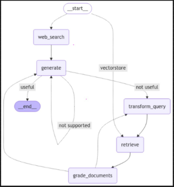
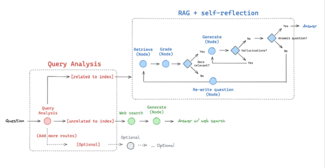

# Adaptive RAG

* Strategy for RAG that unites 1. Query analysis with 2. active/self corrective RAG
* In Query analysis we need to identify whether we need to do do web search or vectorDB
*

    <figure><figcaption></figcaption></figure>

*

    <figure><figcaption></figcaption></figure>
*
