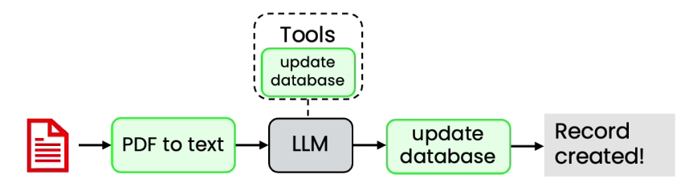
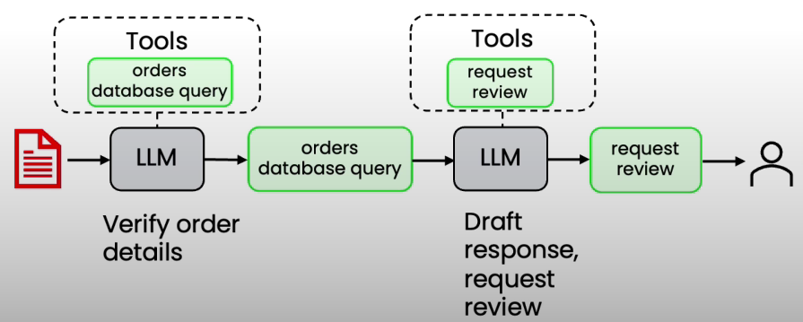

# Agentic AI Applications

**Invoice Processing workflow:**

* Business might require fields like Billers, Billers Address, Amount Due, Due Date
* **Steps:**
  * PDF to Text
  * LLM will look at pdf and check if its invoice or not and then extract the fields
  * Save in DB
  *   Here there is a clear workflow to be followed

      <figure><figcaption></figcaption></figure>

**Responding to Customer email:**

* Extract key information
* Find relevant customer records
* Draft response for human review
*

    <figure><figcaption></figcaption></figure>

**Customer Service Agent:**

* So you have blue or black jeans?
  * Check inventory for black jeans
  * Check inventory for blue jeans
  * Respond to customer
* I would like to return the beach towel i bought
  * Verify customer purchase
  * Check return policies
  * If return allowed
    * issue packing slip
    * Set db to return pending

**Difficult: Visual computer use:**

* Flight search
* It navigates the site
* It can also go to google to check different sites
*
