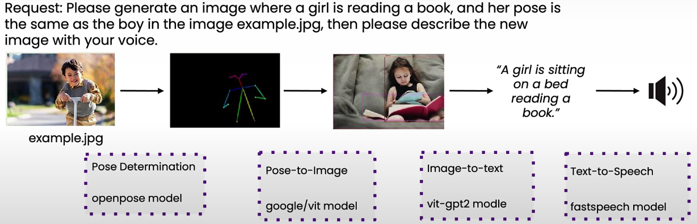

# Agentic Design Patterns

1. **Reflection**

* We can construct a prompt to ask the LLM to examine its output
* Then it might be able to point out its mistake
* We can also have a critique agent to point out the mistakes

2. **Tool use**

* Run the tool to check the output
*

    <figure><figcaption></figcaption></figure>

3. **Planning**

* LLM decides the sequence of actions it needs to take&#x20;
*

    <figure><figcaption></figcaption></figure>

4. **Multi agentic workflow:**

* Multiple agents which specializes in a different role
* Make them work together on a complex task

