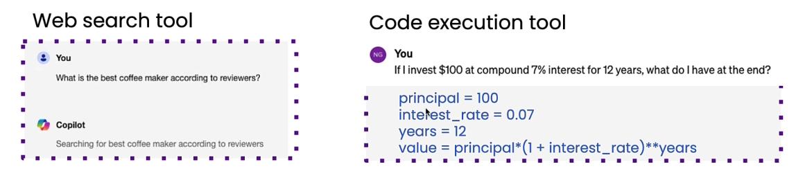
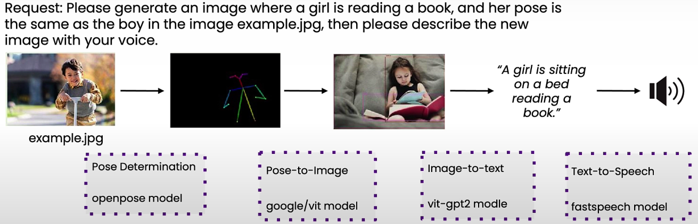

# 🟢 Agentic Design Patterns

1. <mark style="color:purple;background-color:purple;">**Reflection:**</mark>

* <mark style="color:purple;background-color:purple;">**We can construct a prompt to ask the LLM to examine its output**</mark>
* Then it might be able to point out its mistake
* We can also have a critique agent to point out the mistakes

2. **Tool use**

* Run the tool to check the output
*

    <figure><figcaption></figcaption></figure>

3. <mark style="color:purple;background-color:purple;">**Planning:**</mark>

* <mark style="color:purple;background-color:purple;">**LLM decides the sequence of actions it needs to take**</mark>&#x20;
*

    <figure><figcaption></figcaption></figure>

4. <mark style="color:purple;background-color:purple;">**Multi agentic workflow:**</mark>

* <mark style="color:purple;background-color:purple;">**Multiple agents which specializes in a different role**</mark>
* Make them work together on a complex task

