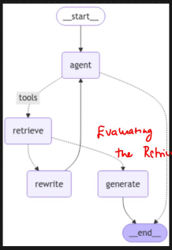

# Agentic RAG

1. **Agentic RAG:** Use an Agent to figure out how to retrieve the most relevant information before using the retrieved info to answer the users question

* RAG is a type of data source using vectorDB&#x20;
* We can create a retriever, which we can use it as a tool and bind with a LLM, which can be converted to Agent
* If the task is related to retriever then it will go to retriever otherwise it will go to end
* If the query needs to be retrieved then go to rewrite otherwise go to generate
* We will validate the data which is retrieved is valid or not, this is done in rewrite, if its validate then we go to generate else it will go to retrieve — Evaludate the retrieved information
*
*

    <figure><figcaption></figcaption></figure>

1.
