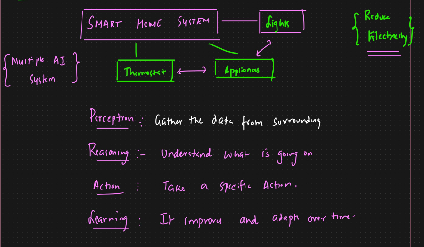

# AI Agents vs Agentic AI

**AI Agents:**

* Individual software programs designed to perform specific tasks with a degree of autonomy
* It will have limited autonomy, it will just perform the given task
* Follows a predefined rule for decision making
* Single entity with a focused purpose

**Agentic AI:**

* Broader framework where multiple AI agents can collaborate and make decisions independently to achieve a large goal, emphasizing adaptability and learning from experience rather than just following predefined rules
* Solving more complex workflows
* Focuses on overall system with the ability to learn, adapt and make more complex decisions
* Works on autonomous decision based on real time data and circumstances
* Network of agents working together to achieve a goal

**Examples:**

* AI Agents ⇒ Customer service chatbot ⇒ Answers basic questions based on predefined script
*   Agentic AI ⇒&#x20;

    <figure><figcaption></figcaption></figure>

