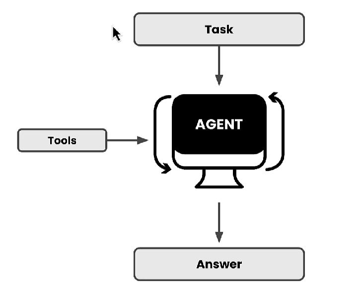

# 🟢 AI Agents

* We can get better results from LLM using feedback
* If we ask GPT about a topic, then it will give output
* If we ask to summarize it then, then it might give even better output
* <mark style="color:purple;background-color:purple;">**We get better results from LLM by interactions and itteration by giving feedback**</mark>
* <mark style="color:purple;background-color:purple;">**But then we might have to keep getting involved to give feedback**</mark>
* <mark style="color:purple;background-color:purple;">**Agents can do this on behalf**</mark>
* An agent gets LLM to get into their thinking process, it asks the questions and answer the question itself to the point that it can better by itself
* So basically we can give a task to Agent and then it comes up with an answer
* Agents becomes more powerful by using tools
* It allows to interact with external world by calling API, posting some data or anything
*

    <figure><figcaption></figcaption></figure>
*
