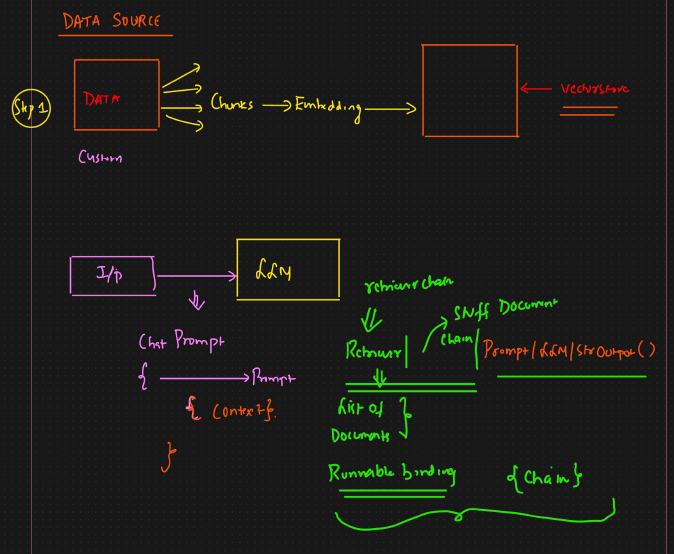

# 🟢 Basic RAG

* We design prompt ⇒ Here we are using chatprompttemplate
* We need to add context to it
* Context is coming from vectorstore
* chain = prompt|LLM|stroutputparser
* We also need to integrate vector DB
* So we convert it into retriever
* <mark style="color:purple;background-color:purple;">**We need to use retriever chain to pass the retriever to chain**</mark>
* <mark style="color:purple;background-color:purple;">**Output of retriever is list of documents**</mark>
* <mark style="color:purple;background-color:purple;">**To combine the document we use stuff document chain**</mark>
* <mark style="color:purple;background-color:purple;">**Since prompt|LLM|stroutput will be fixed**</mark>
*   <mark style="color:purple;background-color:purple;">**And retriever and chain is dynamic so that's why its runnable binding**</mark>

    <figure><figcaption></figcaption></figure>
