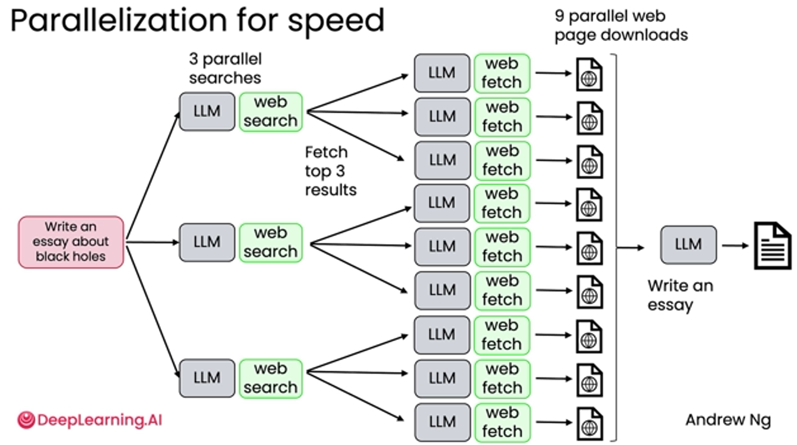

# Benefits of Agentic AI

* **Performance:**
  * Benchmark used in HumanEval
  *   Even the new model is not able to outperform the performance achieve by agentic workflows on previous model

      <figure><figcaption></figcaption></figure>
* **Parallelization of speed:**
  * We can have 3 parallel different websearch&#x20;
  *

      <figure><figcaption></figcaption></figure>
* **Modular/Swap out components:**
  * We can swap web engine in above flow
  * We can swap the LLM
