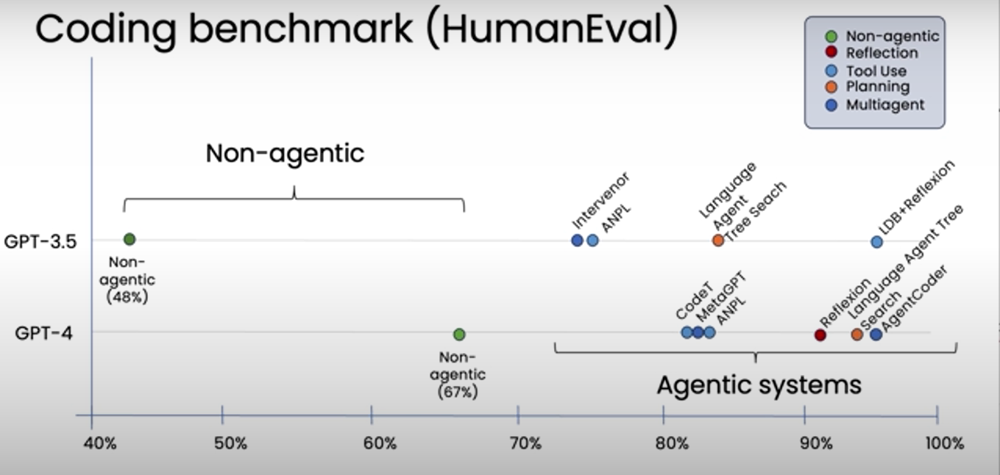
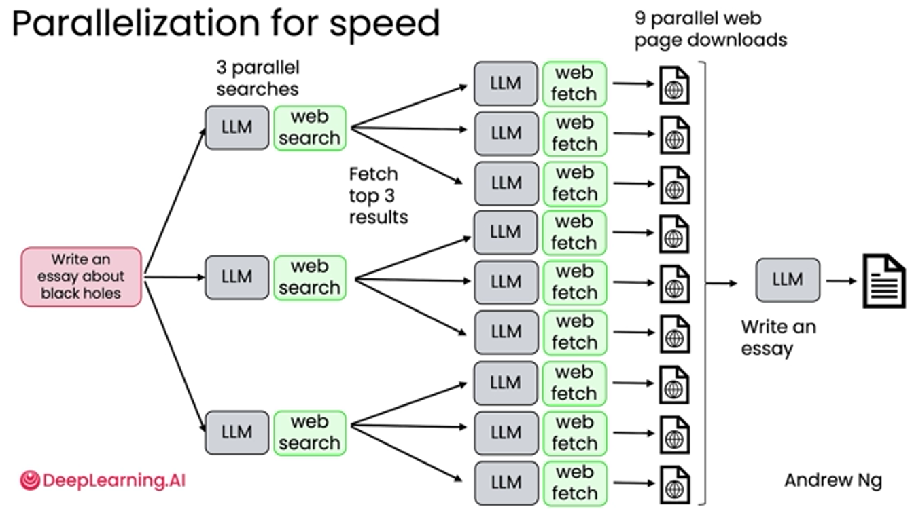

# 🟢 Benefits of Agentic AI

* <mark style="color:purple;background-color:purple;">**Performance:**</mark>
  * Benchmark used in HumanEval
  *   <mark style="color:purple;background-color:purple;">**Even the new model is not able to outperform the performance achieve by agentic workflows on previous model**</mark>

      <figure><figcaption></figcaption></figure>
* <mark style="color:purple;background-color:purple;">**Parallelization of speed:**</mark>
  * <mark style="color:purple;background-color:purple;">**We can have 3 parallel different web search**</mark>
  *

      <figure><figcaption></figcaption></figure>
* <mark style="color:purple;background-color:purple;">**Modular/Swap out components:**</mark>
  * <mark style="color:purple;background-color:purple;">**We can swap web engine in above flow**</mark>
  * <mark style="color:purple;background-color:purple;">**We can swap the LLM**</mark>
