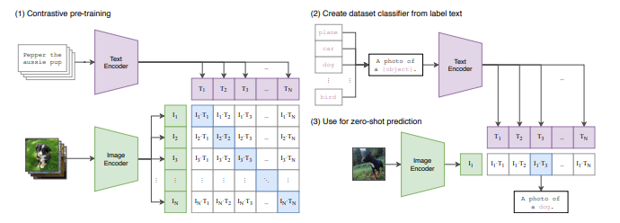

# CLIP

* [https://arxiv.org/pdf/2103.00020](https://arxiv.org/pdf/2103.00020)
* Image to text
* Multimodality
* Previously for image captioning we used to have CNN + LSTM / CNN + BERT ⇒ but they were not much effective
* CLIP is based on transformer
* Based on encoder
* Dual encoder will be trained
  * 1st Encoder for images
  * 2nd Encoder for text
* Image is collection of pixels
* Flatten image(1D Array) is passed to transformer encoder
* Transformer encoder will form contextual embedding
* Text is converted into embedding and passed to transformer encoder which will also give contextual embedding
* In training, we will be having image and its caption, we will be passing it to dual encoder
* We will find the cosine similarity of this 2 contextual embeddings
*

    <figure><figcaption></figcaption></figure>
*

    <figure><figcaption></figcaption></figure>
* Zero shot capabilities
