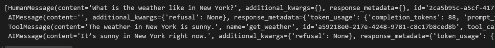

# Code - Basic Agent

* We can also check which tool call is being made and what is getting passed to it, using this we can do debugging
* To get the final messages, we need to take the content of the last message of the response

```python
import langchain
langchain.__version__

import os
from dotenv import load_dotenv
load_dotenv()

os.environ["OPENAI_API_KEY"]=os.getenv("OPENAI_API_KEY")

from langchain.agents import create_agent

def get_weather(city:str)-> str:
    """Get the weather for a city."""
    return f"The weather in {city} is sunny."

agent=create_agent(
    model="gpt-5",
    tools=[get_weather],
    system_prompt="You are a helpful assistant."
)
agent

### run the agent
response=agent.invoke({"messages":[{"role":"user","content":"What is the weather like in New York?"}]})

agent.invoke({"messages":"What is the weather in New Yourk"})
```

*

    <figure><figcaption></figcaption></figure>
*

    <figure><figcaption></figcaption></figure>
