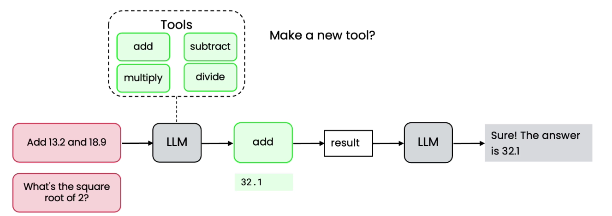
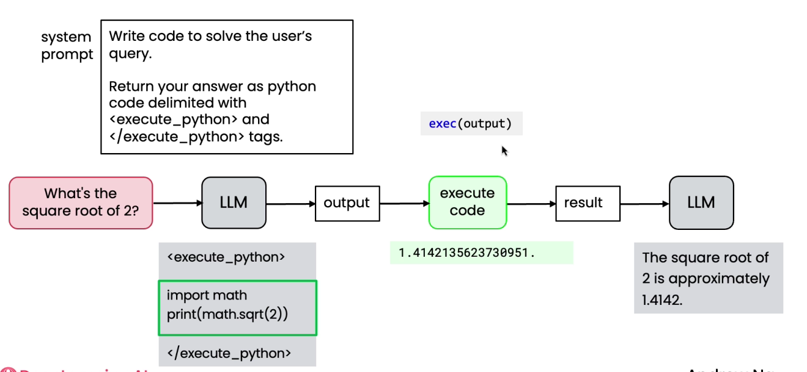
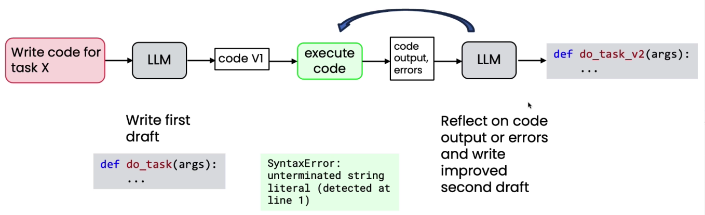

# Code Execution

* &#x20;We have an application of solving maths problem
*

    <figure><figcaption></figcaption></figure>

* We might need tool for more operations
* exec is built in python function for code execution&#x20;
*

    <figure><figcaption></figcaption></figure>
*

    <figure><figcaption></figcaption></figure>
* Running outside of a sandbox can be risky, so that there is less chance of code deletion or damages to the system
