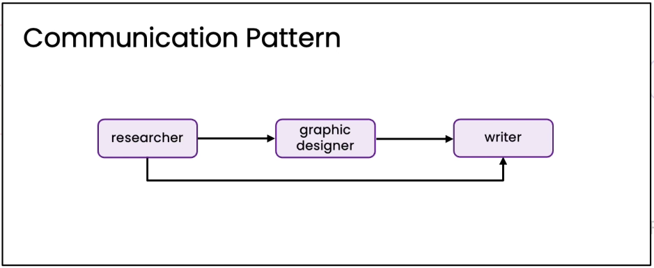
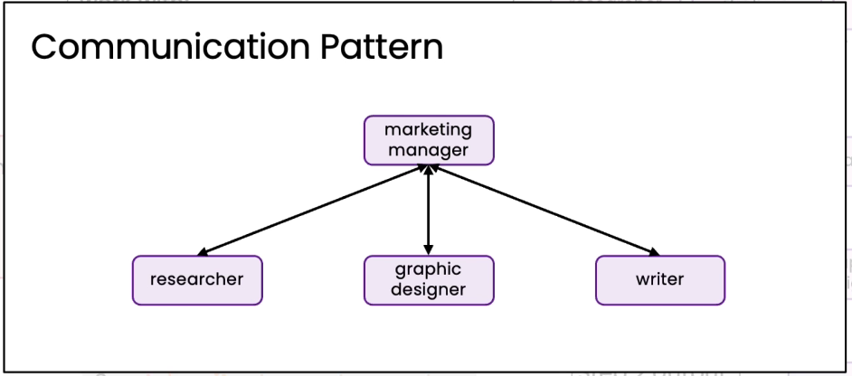
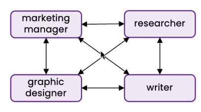

# Communication patterns for multi agents system

* **Linear pattern:**
*

    <figure><figcaption></figcaption></figure>
* **Hierarchical pattern:**
*

    <figure><figcaption></figcaption></figure>
* **Deeper hierarchy:**
*

    <figure><figcaption></figcaption></figure>
* 
* **All to All:**
*

    <figure><figcaption></figcaption></figure>
