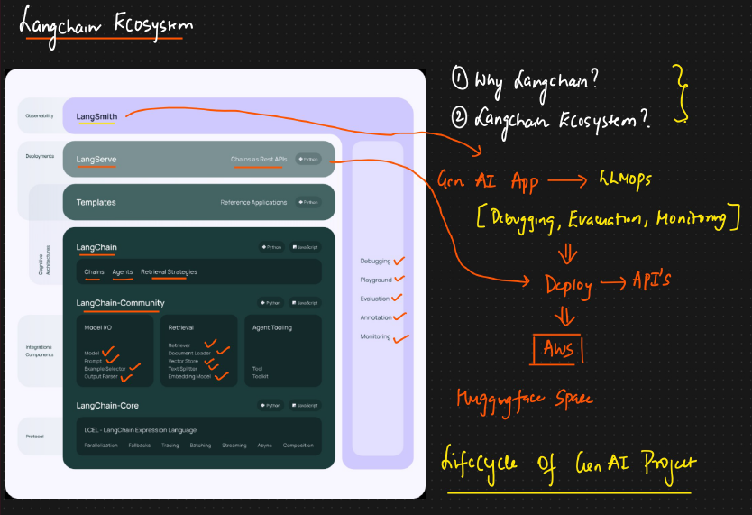

# Complete LangChain Ecosystem

**Why LangChain?**

* <mark style="color:purple;background-color:purple;">**Most common framework for building GenAI**</mark>
* OpenAI and hugging face 1st came up with LLM models
* Open AI had different set of code&#x20;
* Hugging face we used different libraries like transformer
* Then more companies came in the race, different set of libraries were getting created for LLM models
* <mark style="color:purple;background-color:purple;">**LangChain created common framework to develop GenAI apps**</mark>
* <mark style="color:purple;background-color:purple;">**All the modules inside LangChain are opensource**</mark>

**Ecosystem:**

* <mark style="color:purple;background-color:purple;">**LangSmith is used for LLMOps ⇒ Debugging, Evaluation, Monitoring**</mark>
* <mark style="color:purple;background-color:purple;">**LangServe: For createing chain as REST API ⇒ Can be deployed on AWS, HuggingFace space**</mark>
*   <mark style="color:purple;background-color:purple;">**LangChain community: We have models from different providers, so to access it we use this**</mark>

    <figure><figcaption></figcaption></figure>
