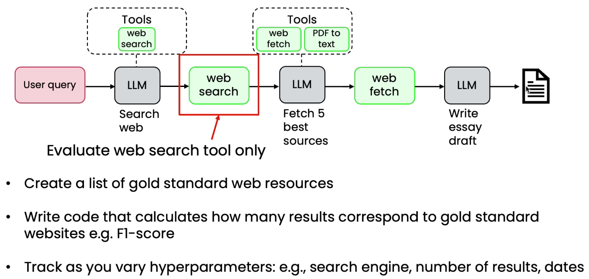

# Component Level Eval

* If we change a component, then to check the results we have to run end to end, which is expensive
* Create a list of gold standard&#x20;
* Write a code to calculate to check how many records corresponds to gold standard
* Track as you vary hyper parameters
* After tuning component, then check end to end&#x20;
*

    <figure><figcaption></figcaption></figure>
