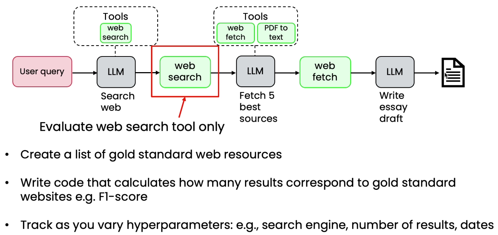

# ✈️ Component Level Eval

* <mark style="color:purple;background-color:purple;">**If we change a component, then to check the results we have to run end to end, which is expensive**</mark>
* <mark style="color:purple;background-color:purple;">**Create a list of gold standard**</mark>&#x20;
* <mark style="color:purple;background-color:purple;">**Write a code to calculate to check how many records corresponds to gold standard**</mark>
* <mark style="color:purple;background-color:purple;">**Track as you vary hyper parameters**</mark>
* After tuning component, then check end to end&#x20;
*

    <figure><figcaption></figcaption></figure>
