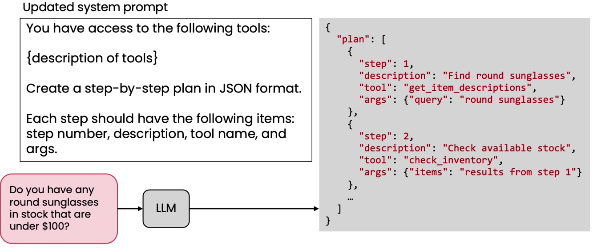

# Creating and executing LLM plans

* Formatting plan as json
* It allows downstream code to parse what exactly are the steps of the plan in relatively clear and unambiguous ways
* It give tools and what arguments will be passed to it
*

    <figure><figcaption></figcaption></figure>
*
