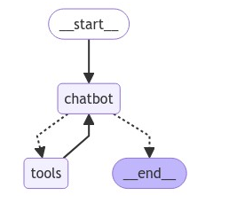

# Creating chatbots with External Tools Workflow

* When we query and if chatbot/llm is not able to answer then it will call the external tool

```python
from typing import Annotated
from typing_extensions import TypedDict

## Working With Tools

from langchain_community.utilities import ArxivAPIWrapper,WikipediaAPIWrapper
from langchain_community.tools import ArxivQueryRun,WikipediaQueryRun

## Arxiv And Wikipedia tools
arxiv_wrapper=ArxivAPIWrapper(top_k_results=1,doc_content_chars_max=300)
arxiv_tool=ArxivQueryRun(api_wrapper=arxiv_wrapper)

api_wrapper=WikipediaAPIWrapper(top_k_results=1,doc_content_chars_max=300)
wiki_tool=WikipediaQueryRun(api_wrapper=api_wrapper)

wiki_tool.invoke("who is Sharukh Khan")
arxiv_tool.invoke("Attention is all you need")

# Here we are using only 1 tool in this application
tools=[wiki_tool]

## Langgraph Application
from langgraph.graph.message import add_messages
class State(TypedDict):
  messages:Annotated[list,add_messages]
  
from langgraph.graph import StateGraph,START,END

graph_builder= StateGraph(State)

from langchain_groq import ChatGroq

from google.colab import userdata
groq_api_key=userdata.get("groq_api_key")
llm=ChatGroq(groq_api_key=groq_api_key,model_name="Gemma2-9b-It")

llm_with_tools=llm.bind_tools(tools=tools)

def chatbot(state:State):
  return {"messages":[llm_with_tools.invoke(state["messages"])]}
  
from langgraph.prebuilt import ToolNode,tools_condition

graph_builder.add_node("chatbot",chatbot)
tool_node = ToolNode(tools=tools)
graph_builder.add_node("tools", tool_node)

graph_builder.add_conditional_edges(
    "chatbot",
    tools_condition,
)
graph_builder.add_edge("tools", "chatbot")
graph_builder.add_edge(START,"chatbot")

graph=graph_builder.compile()

from IPython.display import Image, display

try:
    display(Image(graph.get_graph().draw_mermaid_png()))
except Exception:
    # This requires some extra dependencies and is optional
    pass
  
user_input="Hi there!, My name is John"

events=graph.stream(
     {"messages": [("user", user_input)]},stream_mode="values"
)

for event in events:
  event["messages"][-1].pretty_print()

#================================ Human Message =================================
#
#Hi there!, My name is John
#================================== Ai Message ==================================
#Tool Calls:
#  wikipedia (call_zd9v)
# Call ID: call_zd9v
#  Args:
#    query: John
#/usr/local/lib/python3.10/dist-packages/wikipedia/wikipedia.py:389: GuessedAtParserWarning: No parser was explicitly specified, so I'm using the best available HTML parser for this system ("lxml"). This usually isn't a problem, but if you run this code on another system, or in a different virtual environment, it may use a different parser and behave differently.
#
#The code that caused this warning is on line 389 of the file /usr/local/lib/python3.10/dist-packages/wikipedia/wikipedia.py. To get rid of this warning, pass the additional argument 'features="lxml"' to the BeautifulSoup constructor.
#
#  lis = BeautifulSoup(html).find_all('li')
#================================= Tool Message =================================
#Name: wikipedia
#
#No good Wikipedia Search Result was found
#================================== Ai Message ==================================
#
#Hello John, it's nice to meet you!
#

user_input = "what is RLHF."

# The config is the **second positional argument** to stream() or invoke()!
events = graph.stream(
    {"messages": [("user", user_input)]},stream_mode="values"
)
for event in events:
    event["messages"][-1].pretty_print()
    
#================================ Human Message =================================
#
#what is RLHF.
#================================== Ai Message ==================================
#Tool Calls:
#  wikipedia (call_p19b)
# Call ID: call_p19b
#  Args:
#    query: RLHF
#================================= Tool Message =================================
#Name: wikipedia
#
#Page: Reinforcement learning from human feedback
#Summary: In machine learning, reinforcement learning from human feedback (RLHF) is a technique to align an agent with human preferences. It involves training a reward model to represent preferences previously gathered from a sample of humans, which ca
#================================== Ai Message ==================================
#
#Reinforcement learning from human feedback (RLHF) is a technique to align an agent with human preferences. It involves training a reward model to represent preferences previously gathered from a sample of humans, which can then be used to train a reinforcement learning agent.
```

*

    <figure><figcaption></figcaption></figure>
