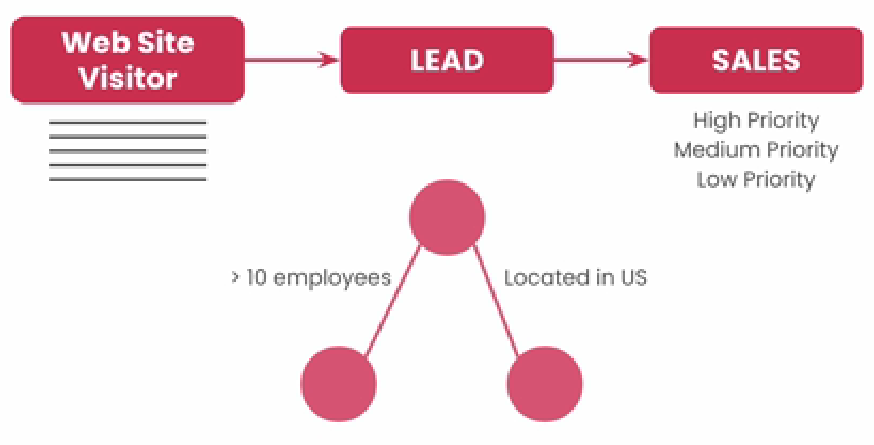
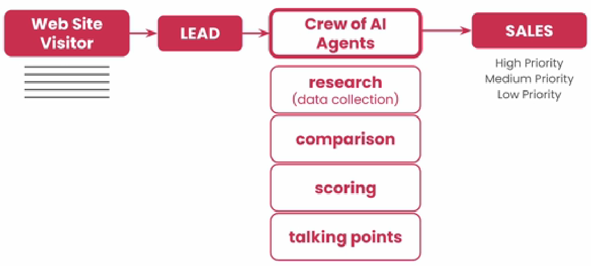

# CrewAI - Business Scenario

* User will enter data on website
* It will be analyzed and classified as High Priority/ Low Priority
*

    <figure><figcaption></figcaption></figure>
* Instead of having else if statement, we can have Agents which can search using different sources
* Then do comparison
* And then do scoring
* Based on scoring we can prioritize
* It can also give topic or questions or points that can be taken up during meeting
*

    <figure><figcaption></figcaption></figure>
