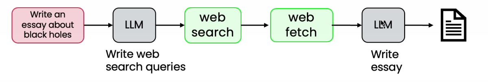
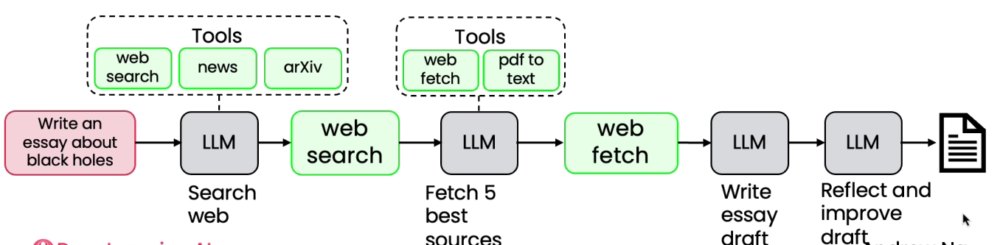

# Degrees of Autonomy

* Rather than arguing over which work to include or exclude as being a true agent, we can acknowledge that there are different degrees to which systems can be agentic

**Less Autonomous:**

* All steps predetermined
* All tools hardcoded
*   Autonomy is in text generation

    <figure><figcaption></figcaption></figure>

**Semi-Autonomous:**

* Agents can make some decisions, choose tools
* All tools predefined

**More Autonomous:**

* Agent makes decisions autonomously
* Can create new agents on the fly
*

    <figure><figcaption></figcaption></figure>

Red - User Input

Grey - LLM

Green - Web search
