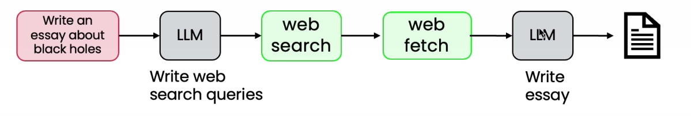
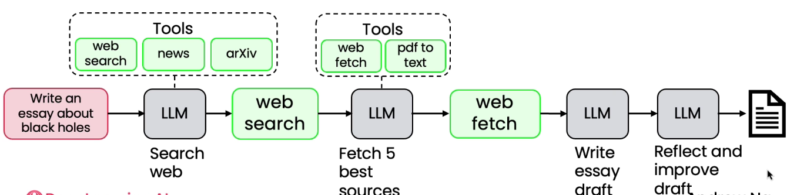

# 🟢 Degrees of Autonomy

* <mark style="color:purple;background-color:purple;">**Rather than arguing over which work to include or exclude as being a true agent, we can acknowledge that there are different degrees to which systems can be agentic**</mark>

<mark style="color:purple;background-color:purple;">**Less Autonomous:**</mark>

* <mark style="color:purple;background-color:purple;">**All steps predetermined**</mark>
* <mark style="color:purple;background-color:purple;">**All tools hardcoded**</mark>
*   Autonomy is in text generation

    <figure><figcaption></figcaption></figure>

<mark style="color:purple;background-color:purple;">**Semi-Autonomous:**</mark>

* <mark style="color:purple;background-color:purple;">**Agents can make some decisions, choose tools**</mark>
* All tools predefined

<mark style="color:purple;background-color:purple;">**More Autonomous:**</mark>

* <mark style="color:purple;background-color:purple;">**Agent makes decisions autonomously**</mark>
* <mark style="color:purple;background-color:purple;">**Can create new agents on the fly**</mark>
*

    <figure><figcaption></figcaption></figure>

Red - User Input

Grey - LLM

Green - Web search
