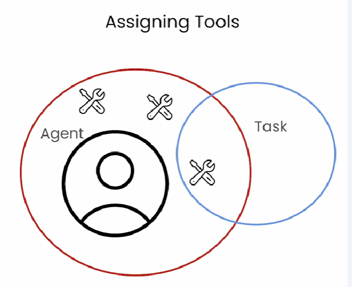

# Different ways to give tools to Agents

* Agent Level: The Agent can use the Tool(s) on any Task it performs.
* Task Level: The Agent will only use the Tool(s) when performing that specific Task.

**Note**: Task Tools override the Agent Tools.

*

    <figure><figcaption></figcaption></figure>
