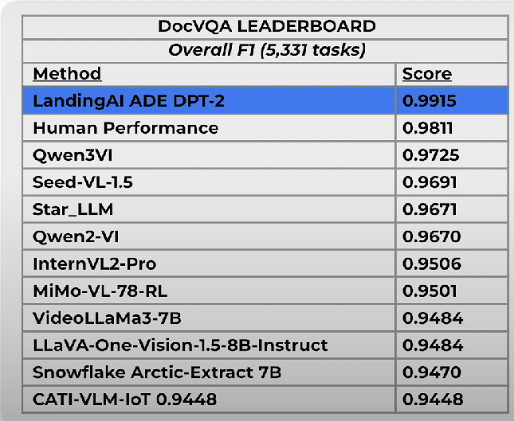

# Document Pre Trained Transformer

**DPT Models:**

* DPT - 1
* DPT - 2
* DPT - 2 - mini

* DocVQA is a benchmark dataset designed to evaluate machine-reading systems on real world document images
*   It test model ability to understand text and layout through question-answering tasks

    <figure><figcaption></figcaption></figure>
