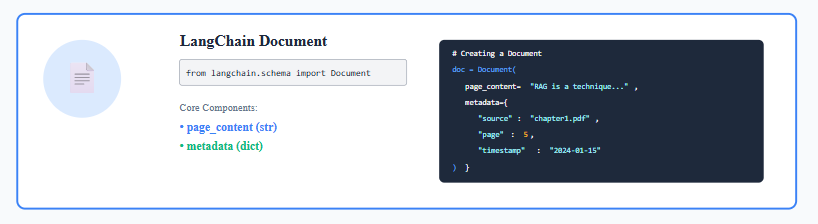
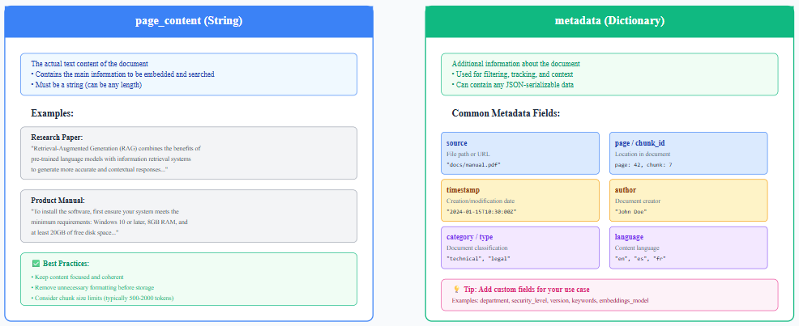
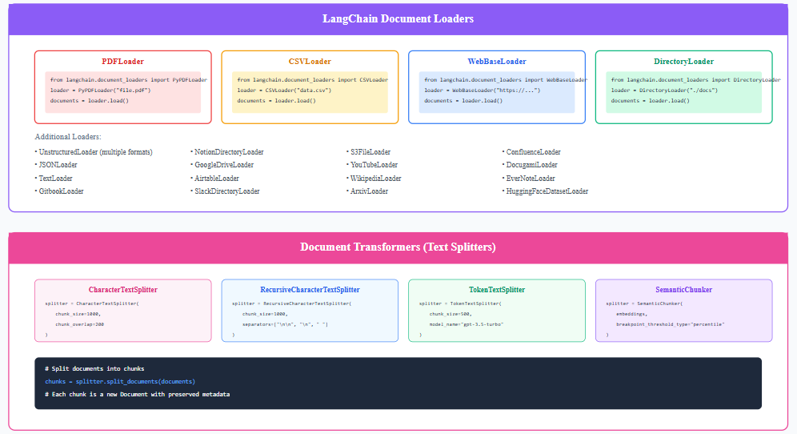

# Document Structure

*   Metadata is important for filtering search results, tracking document sources, providing context in responses, debugging and auditing

    <figure><figcaption></figcaption></figure>
*

    <figure><figcaption></figcaption></figure>
*

    <figure><figcaption></figcaption></figure>
