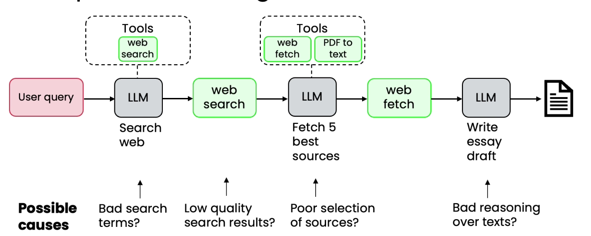
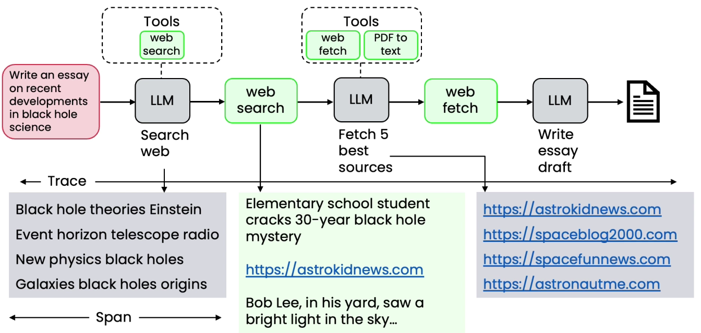
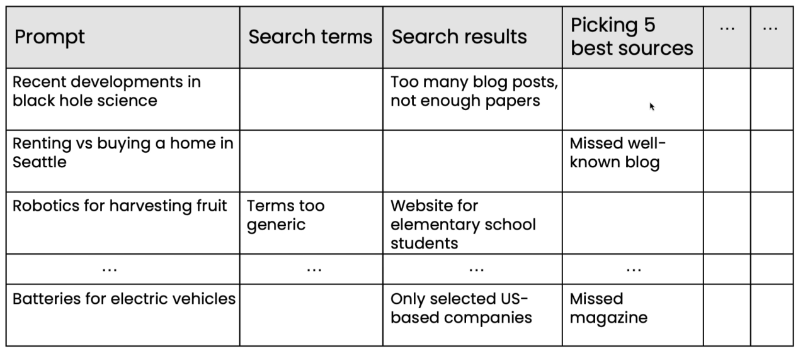

# Error Analysis and prioritizing next steps

* Research agent was missing some points were missing points which human would have made
* Possible causes
  * Bad search terms?
  * Web search giving low quality search results
  * Poor selection of sources
  * Bad reasoning over texts
*

    <figure><figcaption></figcaption></figure>

    * Examine traces to better understand each step in the workflow
    *

        <figure><figcaption></figcaption></figure>
* Better to looking for traces where performance is bad
*

    <figure><figcaption></figcaption></figure>
* We observe search results were giving more issues
* So we should pay attention to fix this
