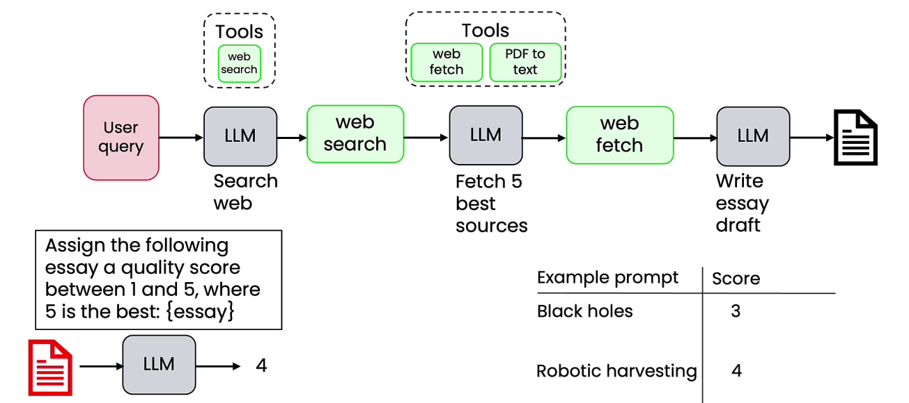

# Evaluating Agentic AI

* For objective eval - Manually look for output which could have been better
* See that output is not mentioning your competors or anything
* First build the Agent and then see where the output is not satisfactory
* We then work on elimiating this
* We can add an Eval to track how often this error occurs
* We can maintain a DB of competitors to check this
* For subjective evaluation we can use LLM as a Judge
* LLM is not that good to give score on a scale, there are better techniques also
*

    <figure><figcaption></figcaption></figure>
*
