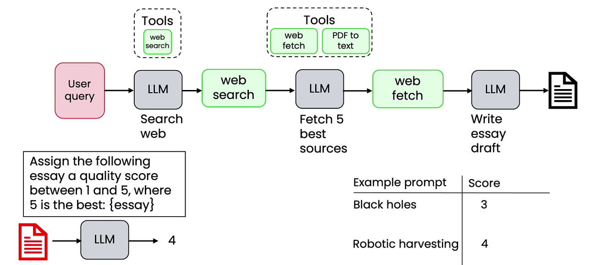

# 🟢 Evaluating Agentic AI

* <mark style="color:$danger;background-color:purple;">**For objective eval - Manually look for output which could have been better**</mark>
* <mark style="color:$danger;background-color:purple;">**See that output is not mentioning your competitors or anything**</mark>
* First build the Agent and then see where the output is not satisfactory
* We then work on eliminating this
* We can add an Eval to track how often this error occurs
* We can maintain a DB of competitors to check this
* <mark style="color:$danger;background-color:purple;">**For subjective evaluation we can use LLM as a Judge ⇒ Use with Rubric grade**</mark>
* LLM is not that good to give score on a scale, there are better techniques also
*

    <figure><figcaption></figcaption></figure>
*
