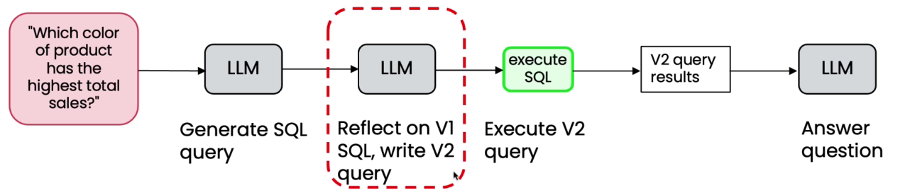
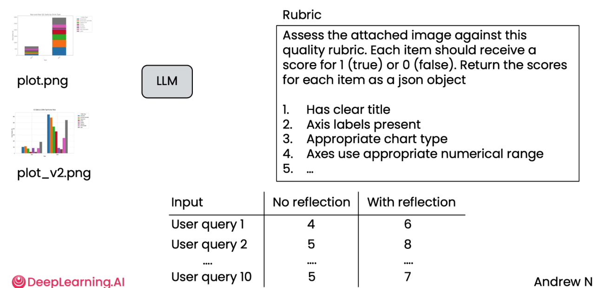

# Evaluating the impact of Reflection

*

    <figure><figcaption></figcaption></figure>

* Collect data of Prompt, ground truth, then run the workflow with and without reflection
* For subjective use LLM as a judge
* Issues with LLM as a judge
  * Answer not very good
  * Position bias ⇒ it might select 1st choice as better or some LLM prefer 2nd always
  * **Instead use rubric grading**
  *

      <figure><figcaption></figcaption></figure>
