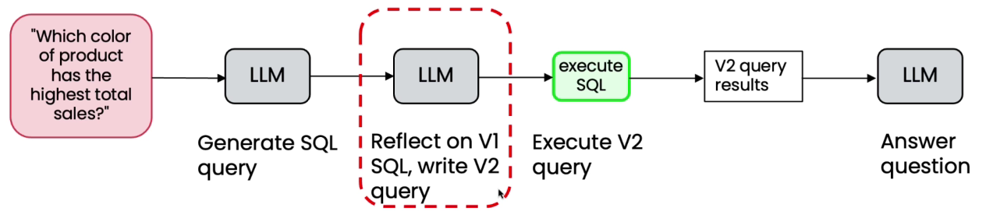
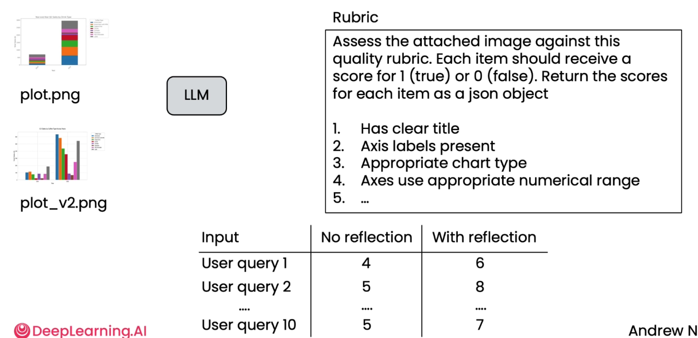

# 🟢 Evaluating the impact of Reflection

*

    <figure><figcaption></figcaption></figure>

* Collect data of Prompt, ground truth, then run the workflow with and without reflection
* <mark style="color:purple;background-color:purple;">**For subjective use LLM as a judge**</mark>
* <mark style="color:purple;background-color:purple;">**Issues with LLM as a judge**</mark>
  * <mark style="color:purple;background-color:purple;">**Answer not very good**</mark>
  * <mark style="color:purple;background-color:purple;">**Position bias ⇒ it might select 1st choice as better or some LLM prefer 2nd always**</mark>
  * <mark style="color:purple;background-color:purple;">**Instead use rubric grading**</mark>
  *

      <figure><figcaption></figcaption></figure>
