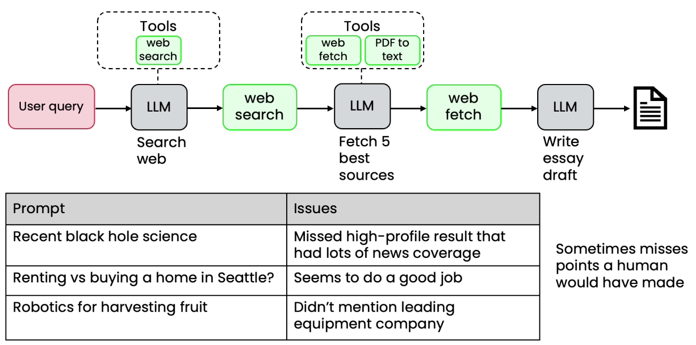

# Evaluation - Research Agent

*

    <figure><figcaption></figcaption></figure>
* Choose 3 to 5 gold standard discussion points for each topic
* Use LLM as a Judge to count how many topic were mentioned
* Get score for each prompt in eval set
*

    <figure><figcaption></figcaption></figure>
