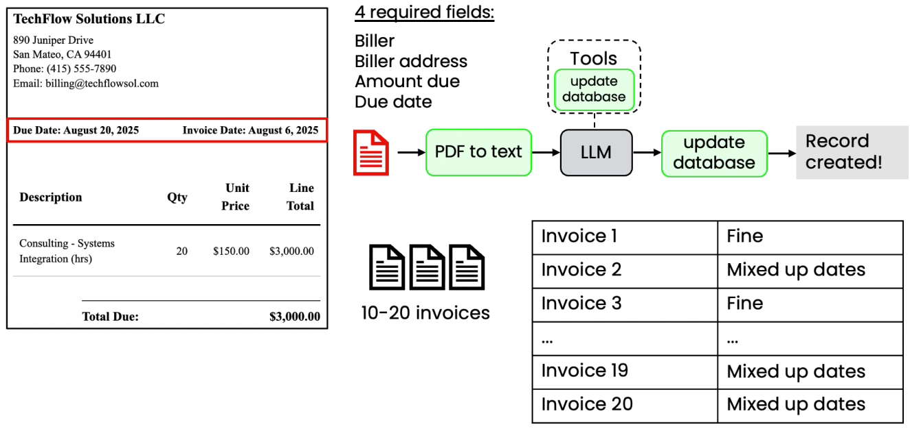

# Evaluations - Invoice Processing Workflow

*   &#x20;

    <figure><figcaption></figcaption></figure>
* Here it is struggling with the dates
* We can write an eval for Due Date
  * Manually extract Due Date
  * Specify output format for date in prompt
  * Compare LLM results to ground truth
* Monitor as you make changes to workflow and see if the metric improves
