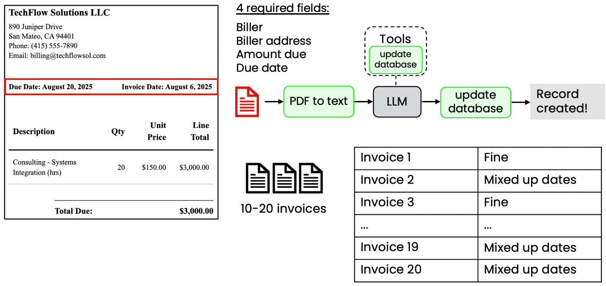

# ✈️ Evaluations - Invoice Processing Workflow

*   &#x20;

    <figure><figcaption></figcaption></figure>
* Here it is struggling with the dates
* <mark style="color:purple;background-color:purple;">**We can write an eval for Due Date**</mark>
  * <mark style="color:purple;background-color:purple;">**Manually extract Due Date**</mark>
  * <mark style="color:purple;background-color:purple;">**Specify output format for date in prompt**</mark>
  * <mark style="color:purple;background-color:purple;">**Compare LLM results to ground truth**</mark>
* <mark style="color:purple;background-color:purple;">**Monitor as you make changes to workflow and see if the metric improves**</mark>
