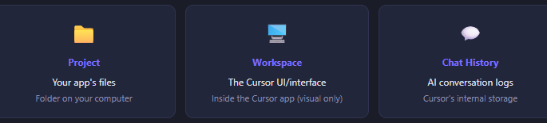

# Folder, Workspace

* Folder on your computer containing everything for one app
* Contains a hidden `.cursor/` subfolder — stores AI rules & settings for that project
* **One folder = one project**
* **A Workspace is the UI/interface you see inside Cursor — it is not a storage location**
* **Chat & agent history is stored internally by Cursor — not in your project folder**
*

    <figure><figcaption></figcaption></figure>
