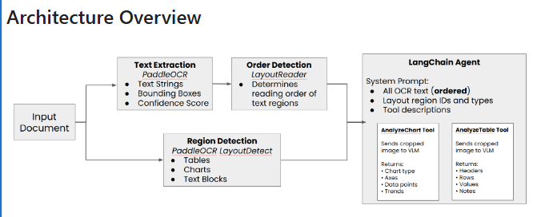

# 🟢 How ChatGPT is Trained - Blog

* [https://www.linkedin.com/pulse/discover-how-chatgpt-istrained-pradeep-menon/](https://www.linkedin.com/pulse/discover-how-chatgpt-istrained-pradeep-menon/)
* To train ChatGPT, a similar method to InstructGPT is used
* <mark style="color:purple;background-color:purple;">**In InstructGPT, you gave one request and got a response**</mark>
* <mark style="color:purple;background-color:purple;">**In ChatGPT we can give multiple request and response preserving the context**</mark>
*

    <figure><figcaption></figcaption></figure>

    \
