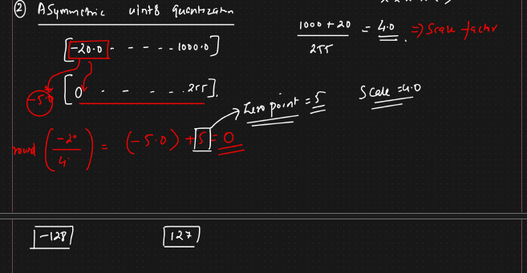

# How to Perform Quantization

**Symmetric Quantization:**

* In DL we use batch normalization ⇒ it is a technique of symmetric quantization
* Symmetric int8
  * Lets all this weights be there in 32bits
  * We want to convert it into unit8 (value will be between 0 to 255)
  * For storing single precision floating point 32
  * 1st bit will be sign, next 8 bit will be there for exponent and remaining 23 bits be saved for mantissa
  * 7.32 ⇒ 1st bit sign, next 7 bit will be 7, 0.32 in mantissa
  * In FP16 ⇒ 1 bit for sign, 5 bit for exponent, 10 bit for mantissa
  * So for this we will be using min max scalar
  *
  *

      <figure><figcaption></figcaption></figure>

**Asymmetric Quantization:**

* We have values -20 to 1000
* The number are not symmetrically distributed ⇒ it might be left or right skewed
* Scale factor will be here 4
* For -20 it will become -5
* But we want 0 to 255
*   So we add zero point also

    <figure><figcaption></figcaption></figure>
