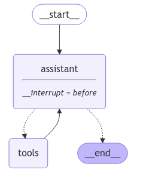
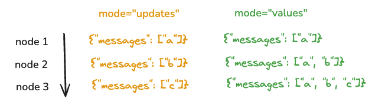
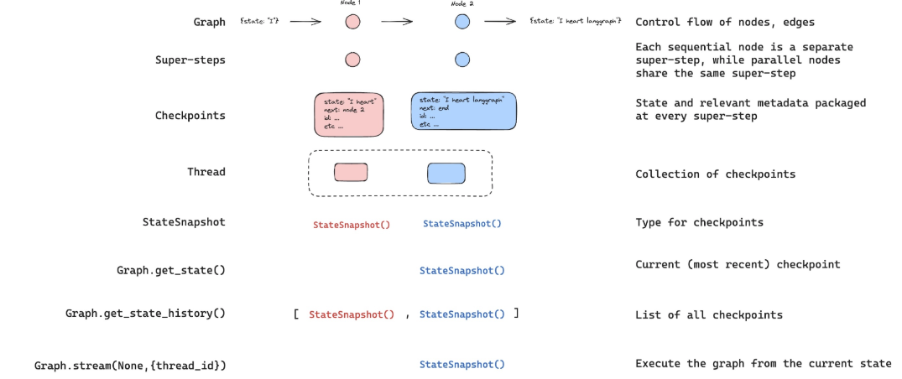

# Human in the loop - Code

* We can interrupt before as well as after for human input
* We are using thread here so we can save it in the memory, so that we can use it later
* To run the graph, we can use invoke or stream/astream
* Stream means as the flow happens, we should also give the output
* In stream, we pass stream mode, it can be values or updates - Refer diagram below for explanation
* state.next tells what is the next that will be executed
* Statesnapshot gives entire information of all the values in the graph
* We can pass none in graph.stream if we dont want to give any human input, so it will continue exeuction — Here it will continue execution from where it had stopped
*

```python
from dotenv import load_dotenv
load_dotenv()
import os

from langchain_groq import ChatGroq


#os.environ["OPENAI_API_KEY"]=os.getenv("OPENAI_API_KEY")
os.environ["GROQ_API_KEY"]=os.getenv("GROQ_API_KEY")


llm=ChatGroq(model="qwen-2.5-32b")

def multiply(a: int, b: int) -> int:
    """Multiply a and b.

    Args:
        a: first int
        b: second int
    """
    return a * b

# This will be a tool
def add(a: int, b: int) -> int:
    """Adds a and b.

    Args:
        a: first int
        b: second int
    """
    return a + b

def divide(a: int, b: int) -> float:
    """Divide a by b.

    Args:
        a: first int
        b: second int
    """
    return a / b

tools = [add, multiply, divide]

llm_with_tools=llm.bind_tools(tools)

from IPython.display import Image, display

from langgraph.checkpoint.memory import MemorySaver
from langgraph.graph import MessagesState
from langgraph.graph import START, StateGraph
from langgraph.prebuilt import tools_condition, ToolNode

from langchain_core.messages import AIMessage, HumanMessage, SystemMessage

# System message
sys_msg = SystemMessage(content="You are a helpful assistant tasked with performing arithmetic on a set of inputs.")

# Node
def assistant(state: MessagesState):
   return {"messages": [llm_with_tools.invoke([sys_msg] + state["messages"])]}

# Graph
builder = StateGraph(MessagesState)

# Define nodes: these do the work
builder.add_node("assistant", assistant)
builder.add_node("tools", ToolNode(tools))

# Define edges: these determine the control flow
builder.add_edge(START, "assistant")
builder.add_conditional_edges(
    "assistant",
    # If the latest message (result) from assistant is a tool call -> tools_condition routes to tools
    # If the latest message (result) from assistant is a not a tool call -> tools_condition routes to END
    tools_condition,
)
builder.add_edge("tools", "assistant")

memory = MemorySaver()
## human in the loop
graph = builder.compile(interrupt_before=["assistant"], checkpointer=memory)

# Show
display(Image(graph.get_graph().draw_mermaid_png()))

initial_input={"messages":HumanMessage(content="Multiply 2 and 3")}

thread={"configurable":{"thread_id":"1"}}

for event in graph.stream(initial_input,thread,stream_mode="values"):
    event['messages'][-1].pretty_print()
#================================ Human Message =================================
#Multiply 2 and 3

state=graph.get_state(thread)
state.next
# ('assistant',)

state
# StateSnapshot(values={'messages': [HumanMessage(content='Multiply 2 and 3',
# additional_kwargs={}, response_metadata={}, id='193dbdc7-ebf1-4219-b066-0f1bdb79f954')
# ]}, next=('assistant',), config={'configurable': {'thread_id': '1',
# 'checkpoint_ns': '', 'checkpoint_id': '1eff1cfa-5acb-6288-8000-7c929c73ff84'}},
# metadata={'source': 'loop', 'writes': None, 'thread_id': '1', 'step': 0, 'parents':
# {}}, created_at='2025-02-23T10:19:21.185754+00:00', parent_config={'configurable':
# {'thread_id': '1', 'checkpoint_ns': '', 'checkpoint_id': 
#'1eff1cfa-5ac8-6b7f-bfff-54e52241bd51'}}, tasks=(PregelTask(id='559a17d7-68c4-f
# 766-7c49-dbfd200e7b34', name='assistant', path=('__pregel_pull', 'assistant'),
# error=None, interrupts=(), state=None, result=None),))

for event in graph.stream(None,thread,stream_mode="values"):
    event['messages'][-1].pretty_print()
```

*

    <figure><figcaption></figcaption></figure>
*

    <figure><figcaption><p>Stream mode</p></figcaption></figure>
*

    <figure><figcaption><p>Snapshot</p></figcaption></figure>
