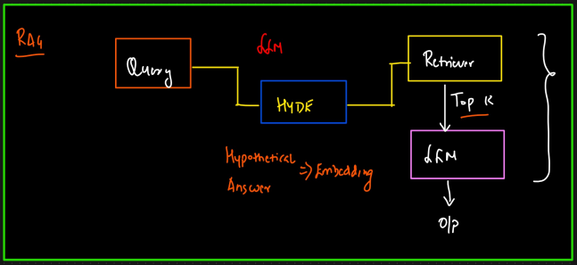

# HyDE

* Hypothetical document embedding
* Instead of embedding the users query directly, you first generate a hypothetical answer to the query using an LLM, and then embed that hypothetical document to search your vector store
* Used when?
  * Queries are short
  * Language mismatch
  * Retrieve based on answer content and not on query
*

    <figure><figcaption></figcaption></figure>
