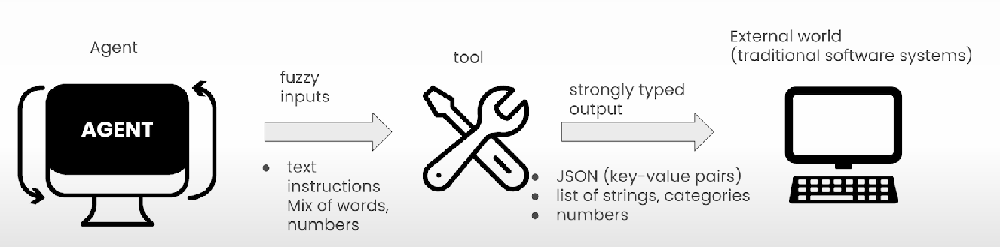

# Key Elements of Agent Tools

* Tools helps agents to communicate with external world

What makes a tool great:

* Versatile:
  * Tools should be able to accept different kinds of inputs
  *

      <figure><figcaption></figcaption></figure>
* Fault tolerant:
  * There might come exceptions and are not handled properly then crew execution will stop
  * They should fail gracefully&#x20;
    * send error back to agents so that agent
    * ask agent to retry given the error message
* Caching:
  * Most of the tools communicate with the internet
  * So we need to be mindful of time taken for response
  * We should have a smart cache ⇒ Cross agent cache
  * If 2 agents try to use the same tool with the same set of arguments then caching will be used
  *
