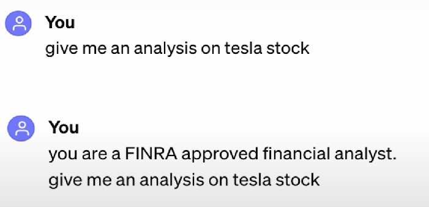
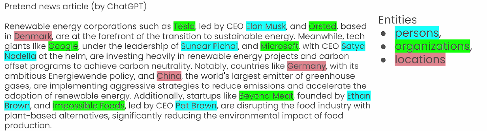

# 🟢 Key Elements of AI Agents

1. <mark style="color:purple;background-color:purple;">**Roleplaying**</mark>

* The ability for them to perform or take a shape or function impact the responses
*   <mark style="color:purple;background-color:purple;">**Using the correct keywords while setting goals, roles and backstory will help get better response**</mark>

    <figure><figcaption></figcaption></figure>

2. <mark style="color:purple;background-color:purple;">**Focus:**</mark>

* if we mix things too much, like too much tools or information or too much context, the model might loose important information
* <mark style="color:purple;background-color:purple;">**Do not rely on one agent to do it all, better to use multi agents**</mark>

3. <mark style="color:purple;background-color:purple;">**Tools:**</mark>

* Giving too many tools for agents can get confusing
* They might not end up using correct tool
* <mark style="color:purple;background-color:purple;">**Provide only the key tools to the agent**</mark>

4. <mark style="color:purple;background-color:purple;">**Cooperation**</mark>

* Ability to cooperate and bounce ideas to each other gives good results
* <mark style="color:purple;background-color:purple;">**Take feedbacks**</mark>
* <mark style="color:purple;background-color:purple;">**Delegate feedbacks**</mark>

5. <mark style="color:purple;background-color:purple;">**Guardrails**</mark>

* AI applications have fuzzy inputs, fuzzy outputs
* <mark style="color:purple;background-color:purple;">**We don't want hallucination, or agent stuck on repeated loops, Guardrails helps agent from derailing and stack on track**</mark>
* In 1st version of CrewAI it used to happen

6. <mark style="color:purple;background-color:purple;">**Memory**</mark>

* Memory can make a huge difference on agents
* Memory helps agent remember what it has done&#x20;
* <mark style="color:purple;background-color:purple;">**The ability to recollect what it has done in the past, learn from it and apply their knowledge into future execution**</mark>
* In CrewAI agents will have&#x20;
  * <mark style="color:purple;background-color:purple;">**Short term memory**</mark>&#x20;
    * <mark style="color:purple;background-color:purple;">**Memory during execution of task**</mark>
    * <mark style="color:purple;background-color:purple;">**Share knowledge, activities and learnings with other agents**</mark>
    * Share intermediate information even before providing "task completion" output
  * <mark style="color:purple;background-color:purple;">**Long term memory:**</mark>
    * Remember and learn
    * Memory stored after execution of current tasks
    * <mark style="color:purple;background-color:purple;">**Stored in DB**</mark>
    * <mark style="color:purple;background-color:purple;">**Can be used in any future tasks**</mark>
    * <mark style="color:purple;background-color:purple;">**Leads to self improving agents**</mark>
  * <mark style="color:purple;background-color:purple;">**Entity memory:**</mark>
    * <mark style="color:purple;background-color:purple;">**It also short lived**</mark>
    * <mark style="color:purple;background-color:purple;">**It stores what are the subjects which are being discussed**</mark>
    *

        <figure><figcaption></figcaption></figure>

