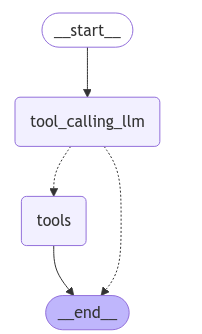

# LangGraph Chains

*  Qwen is model from Alibaba
* Here we are binding tools with our LLM
* Here when we are invoking then content is coming blank and tool call is coming, this is the decision been taken by LLM
* Check usage of annotated — in lecture it was said that otherwise list will overwrite
* For node with tool functionality we create toolnode

```python
import os
from dotenv import load_dotenv
load_dotenv()

os.environ["GROQ_API_KEY"]=os.getenv("GROQ_API_KEY")

from langchain_groq import ChatGroq

llm=ChatGroq(model="qwen-2.5-32b")
result=llm.invoke(messages)

def add(a:int,b:int)-> int:
    """Add a and b.

    Args:
        a: first int
        b: second int
    """
    return a+b

llm_with_tools=llm.bind_tools([add])

tool_call=llm_with_tools.invoke([HumanMessage(content=f"What is 2 plus 3", name="Lance")])
tool_call
# AIMessage(content='', additional_kwargs={'tool_calls': [{'id': 'call_z49q', 
#'function': {'arguments': '{"a": 2, "b": 3}', 'name': 'add'}, 'type': 'function'}]},
# response_metadata={'token_usage': {'completion_tokens': 25, 'prompt_tokens': 173,
# 'total_tokens': 198, 'completion_time': 0.062801554, 'prompt_time': 0.010412756,
# 'queue_time': 0.024864786, 'total_time': 0.07321431}, 'model_name': 'qwen-2.5-32b',
# 'system_fingerprint': 'fp_7b9ecfcd5f', 'finish_reason': 'tool_calls', 'logprobs':
# None}, id='run-abd0b278-675e-47c2-91f4-783725579ada-0', tool_calls=[{'name': 'add',
# 'args': {'a': 2, 'b': 3}, 'id': 'call_z49q', 'type': 'tool_call'}], 
# usage_metadata={'input_tokens': 173, 'output_tokens': 25, 'total_tokens': 198})

tool_call.tool_calls
#[{'name': 'add',
#  'args': {'a': 2, 'b': 3},
#  'id': 'call_z49q',
#  'type': 'tool_call'}]

from typing_extensions import TypedDict
from langchain_core.messages import AnyMessage
from typing import Annotated
from langgraph.graph.message import add_messages

class MessageState(TypedDict):
    messages:Annotated[list[AnyMessage],add_messages]

initial_message=[AIMessage(content="Hello! How can I assist you?", name="Model"),
                    HumanMessage(content="I'm looking for information on generative ai.", name="Krish")
                   ]
# New message to add
new_message = AIMessage(content="Sure, I can help with that. What specifically are you interested in?", name="Model")

add_messages(initial_message,new_message)

from IPython.display import Image, display
from langgraph.graph import StateGraph, START, END
    
# Node
def tool_calling_llm(state: MessageState):
    return {"messages": [llm_with_tools.invoke(state["messages"])]}

# Build graph
builder = StateGraph(MessageState)
builder.add_node("tool_calling_llm", tool_calling_llm)
builder.add_edge(START, "tool_calling_llm")
builder.add_edge("tool_calling_llm", END)
graph = builder.compile()

# View
display(Image(graph.get_graph().draw_mermaid_png()))

messages=graph.invoke({"messages":HumanMessage(content="What is 2 minus 3")})
for m in messages['messages']:
    m.pretty_print()
#================================ Human Message =================================
#What is 2 minus 3
#================================== Ai Message ==================================
#Tool Calls:
#  add (call_f9wh)
# Call ID: call_f9wh
#  Args:
#    a: 2
#    b: -3

from langchain_openai import ChatOpenAI

def multiply(a: int, b: int) -> int:
    """Multiply a and b.

    Args:
        a: first int
        b: second int
    """
    return a * b

llm = ChatOpenAI(model="gpt-4o")

llm_with_tools = llm.bind_tools([multiply,add])

from IPython.display import Image, display
from langgraph.graph import StateGraph, START, END
from langgraph.graph import MessagesState
from langgraph.prebuilt import ToolNode
from langgraph.prebuilt import tools_condition

# Node
def tool_calling_llm(state: MessagesState):
    return {"messages": [llm_with_tools.invoke(state["messages"])]}

# Build graph
builder = StateGraph(MessagesState)
builder.add_node("tool_calling_llm", tool_calling_llm)
builder.add_node("tools", ToolNode([multiply,add]))

builder.add_edge(START, "tool_calling_llm")
builder.add_conditional_edges(
    "tool_calling_llm",
    # If the latest message (result) from assistant is a tool call -> tools_condition routes to tools
    # If the latest message (result) from assistant is a not a tool call -> tools_condition routes to END
    tools_condition,
)
builder.add_edge("tools", END)
#builder.add_edge("tool2", END)
graph = builder.compile()

# View
display(Image(graph.get_graph().draw_mermaid_png()))

from langchain_core.messages import HumanMessage
messages = [HumanMessage(content="Add 3 and 4. Multiply the output by 2 and add 5.")]
messages = graph.invoke({"messages": messages})
for m in messages['messages']:
    m.pretty_print()
#================================ Human Message =================================
#Add 3 and 4. Multiply the output by 2 and add 5.
#================================== Ai Message ==================================
# Tool Calls:
#  add (call_eabXXmQTsnQRa5FW4b4QgP9U)
# Call ID: call_eabXXmQTsnQRa5FW4b4QgP9U
#  Args:
#    a: 3
#    b: 4
#  multiply (call_xPZ4d9WDt0sgSvGtrowA0QvJ)
# Call ID: call_xPZ4d9WDt0sgSvGtrowA0QvJ
#  Args:
#    a: 7
#    b: 2
# ================================= Tool Message =================================
# Name: add
# 7
# ================================= Tool Message =================================
# Name: multiply
# 14


```

*

    <figure><figcaption></figcaption></figure>
*

    <figure><figcaption></figcaption></figure>
