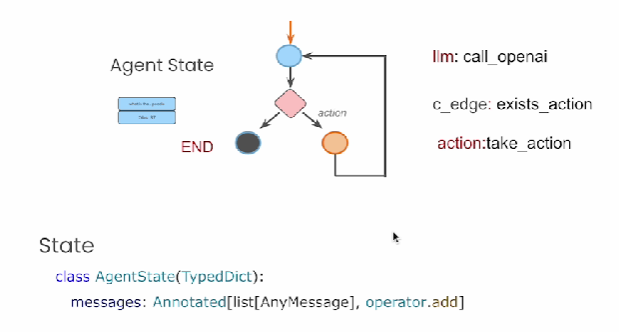

# LangGraph - Code

*   &#x20;

    <figure><figcaption></figcaption></figure>

Code:

* Typing and operator are used for agent state
* Create a class for agent state
* Create a class Agent:
  * constructor:
    * Initilize agent state
    * Add llm node
    * Add action node
    * add condtional edge: if action exists ⇒ llm ⇒  action, else llm ⇒ END
      * if llm response contains tools\_calls then it means action needs to be taken
    * Regular edge : action ⇒ llm
    * set entry point ⇒ llm
    * graph.compile ⇒ This gives langchain runnable
  * exists\_action:
    * Checks if the llm response contains tool call
  * call\_openai:
    * Get messages from agent state
    * Invoke llm with messages
    * Get the response
  * take\_action:
    * Take the message of the agent state
    * Make the tool call
    * Get the response back

```python
from dotenv import load_dotenv
_ = load_dotenv()

from langgraph.graph import StateGraph, END
from typing import TypedDict, Annotated
import operator
from langchain_core.messages import AnyMessage, SystemMessage, HumanMessage, ToolMessage
from langchain_openai import ChatOpenAI
from langchain_community.tools.tavily_search import TavilySearchResults

tool = TavilySearchResults(max_results=4)

class AgentState(TypedDict):
    messages: Annotated[list[AnyMessage], operator.add]

class Agent:

    def __init__(self, model, tools, system=""):
        self.system = system
        graph = StateGraph(AgentState)
        graph.add_node("llm", self.call_openai)
        graph.add_node("action", self.take_action)
        graph.add_conditional_edges(
            "llm",
            self.exists_action,
            {True: "action", False: END}
        )
        graph.add_edge("action", "llm")
        graph.set_entry_point("llm")
        self.graph = graph.compile()
        self.tools = {t.name: t for t in tools}
        self.model = model.bind_tools(tools)

    def exists_action(self, state: AgentState):
        result = state['messages'][-1]
        return len(result.tool_calls) > 0

    def call_openai(self, state: AgentState):
        messages = state['messages']
        if self.system:
            messages = [SystemMessage(content=self.system)] + messages
        message = self.model.invoke(messages)
        return {'messages': [message]}

    def take_action(self, state: AgentState):
        tool_calls = state['messages'][-1].tool_calls
        results = []
        for t in tool_calls:
            print(f"Calling: {t}")
            if not t['name'] in self.tools:      # check for bad tool name from LLM
                print("\n ....bad tool name....")
                result = "bad tool name, retry"  # instruct LLM to retry if bad
            else:
                result = self.tools[t['name']].invoke(t['args'])
            results.append(ToolMessage(tool_call_id=t['id'], name=t['name'], content=str(result)))
        print("Back to the model!")
        return {'messages': results}

prompt = """You are a smart research assistant. Use the search engine to look up information. \
You are allowed to make multiple calls (either together or in sequence). \
Only look up information when you are sure of what you want. \
If you need to look up some information before asking a follow up question, you are allowed to do that!
"""

model = ChatOpenAI(model="gpt-3.5-turbo")  #reduce inference cost
abot = Agent(model, [tool], system=prompt)

from IPython.display import Image

Image(abot.graph.get_graph().draw_png())

messages = [HumanMessage(content="What is the weather in sf?")]
result = abot.graph.invoke({"messages": messages})
# Calling: {'name': 'tavily_search_results_json',
# 'args': {'query': 'weather in San Francisco'}, 'id':
# 'call_PvPN1v7bHUxOdyn4J2xJhYOX'}
# Back to the model!

result['messages'][-1].content
# 'The weather in San Francisco today is sunny with a high of 64°F and
#  a low of 59°F. There is no precipitation expected.'

messages = [HumanMessage(content="What is the weather in SF and LA?")]
result = abot.graph.invoke({"messages": messages})
# Calling: {'name': 'tavily_search_results_json', 'args': 
# {'query': 'weather in San Francisco'}, 'id': 'call_3AAaDSfchif60Drx9QyyOiZS'}
# Calling: {'name': 'tavily_search_results_json', 'args':
# {'query': 'weather in Los Angeles'}, 'id': 'call_Ldw8ZaATItg9oW0SRBlhKtpc'}
# Back to the model!


```

*

    <figure><figcaption></figcaption></figure>
