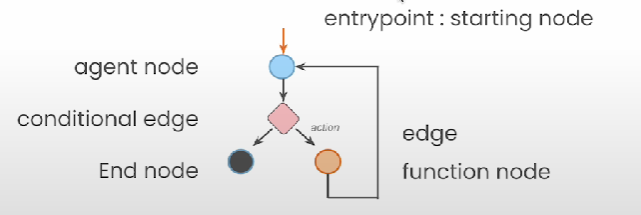
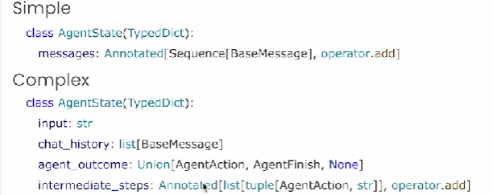

# 🟢 LangGraph Components

* <mark style="color:purple;background-color:purple;">**Prompt templates: Allows reusable prompts**</mark>
* <mark style="color:purple;background-color:purple;">**LangChain community contains 100s of tools**</mark>
* <mark style="color:purple;background-color:purple;">**New in LangGraph:**</mark>
  * <mark style="color:purple;background-color:purple;">**Cyclic Graphs**</mark>
  * <mark style="color:purple;background-color:purple;">**Persistence**</mark>
  * <mark style="color:purple;background-color:purple;">**Human-in-the-loop**</mark>
* LangGraph is an extension of LangChain that supports graphs
* Single and multi agents flows are described and respresented as graphs
* <mark style="color:purple;background-color:purple;">**Allows for extremely controlled flows**</mark>
* Built-in persistence allows for human in the loop workflows

<mark style="color:purple;background-color:purple;">**Core Concepts**</mark>

* <mark style="color:purple;background-color:purple;">**Nodes: Agents or functions**</mark>
* <mark style="color:purple;background-color:purple;">**Edges: connect nodes**</mark>
* <mark style="color:purple;background-color:purple;">**Conditional edges: Decisions**</mark>
*

    <figure><figcaption></figcaption></figure>
* Agent state is accessible to all parts of the graph
* It is local to the graph
* Can be stored in a persistent layer
*

    <figure><figcaption></figcaption></figure>
