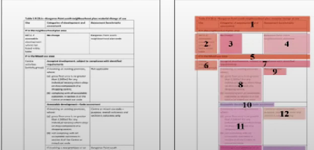

# 🟢 Layout detection and Reading order

* <mark style="color:$danger;background-color:purple;">**Layout detection is the process of identifying and labelling regions in document images: text blocks, tables, images and their relationship**</mark>
* If it is labelled like charts, header, footers, etc then its helpful for downstream model
* Reading order is processing of determining the correct sequence for text blocks, is crucial for complex layouts where spatial arrangements conveys semantic relationship
*

    <figure><figcaption></figcaption></figure>

* Layout reader is model developed by microsoft in 2021
* It takes ocr produced bouding boxes and rearranges the documents token sequence to reconstruct a human readable reading order
