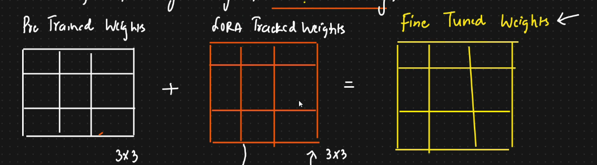

# LORA and QLORA mathematical intuition

Full Parameter fine tuning:

* Base model has been trained with huge amount of data
* Suppose we do fine tuning all the weight of the base model ⇒ This is known as full parameter fine tuning
* We can also perform further domain specific fine tuning
* We can also perform further specific task fine tuning
* Challenges:
  * Update all the model weights
  * Hardware resource constraint
*   To overcome this we will be using LORA and QLORA

    <figure><figcaption></figcaption></figure>

LoRA:

* Research paper ⇒ Low Rank Adapton of large language models
* Used in fine tuning
* Instead of updating weight, it will track the changes
* Pre trained + Lora tracked weights = Fine tuned weights
* Resource constraint wont happen, as matrix decomposition will be used here
*

    <figure><figcaption></figcaption></figure>
*

    <figure><figcaption></figcaption></figure>
* There will be loss in precision, but number of weights will be reduced
* Rank ==== To be google and check
*

    <figure><figcaption></figcaption></figure>
*

    <figure><figcaption></figcaption></figure>
* If the model wants to learn complex things, then use high rank

**QLORA:**

* Quantized LORA
* In this the weight will be converted to lower bits
