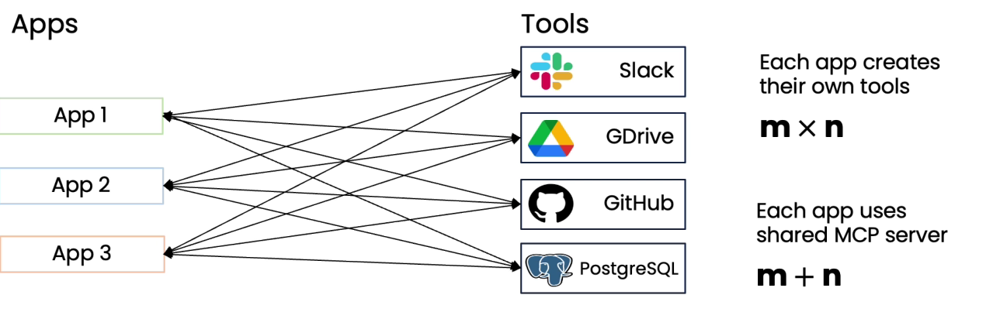

# ✈️ MCP

* Standard proposed by Antropic
* <mark style="color:purple;background-color:purple;">**Many developer will be developing custom wrapers around same data sources**</mark>
* <mark style="color:purple;background-color:purple;">**MCP proposed standard for application to get access to tools and data sources**</mark>&#x20;
*

    <figure><figcaption></figcaption></figure>
