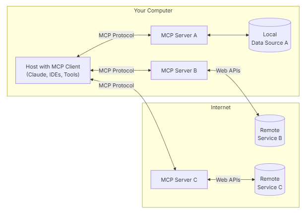

# MCP - Architecture

* **MCP Hosts**: Programs like Claude Desktop, IDEs, or AI tools that want to access data through MCP
* **MCP Clients**: Protocol clients that maintain 1:1 connections with servers
* **MCP Servers**: Lightweight programs that each expose specific capabilities through the standardized Model Context Protocol
* **Local Data Sources**: Your computer’s files, databases, and services that MCP servers can securely access
* **Remote Services**: External systems available over the internet (e.g., through APIs) that MCP servers can connect to
*

    <figure><figcaption></figcaption></figure>
