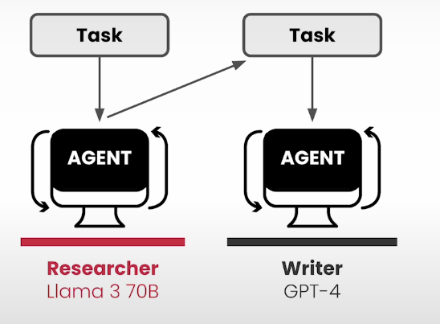

# Multi Agent Benefits

* Each agent can be customized to do one single thing and do it well
* One agent can we writer and another be researcher
* Each agent can use different LLM
*

    <figure><figcaption></figcaption></figure>
