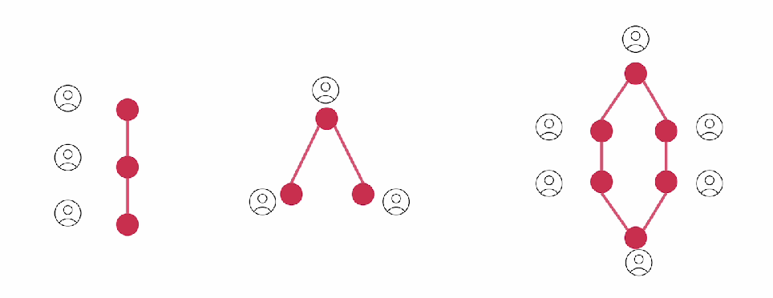

# Multi Agent Collaboration

* With no collaboration, one agent will finish the task and then it will go to the next agent
* We can do that in parallel as well
* But for different tasks we might want to organize the agents differently
* Initial context, starts fade away as it moves from one agent to another

Processes:

* In hierarchical we get an advantage that the manager always remember the initial goal
* It also reviews the results
* We can also do asynchronous execution
*

    <figure><figcaption></figcaption></figure>

Collaboration:

* We can have agents ask question, vaguely talk to each other
* This happens independently of the process
*
