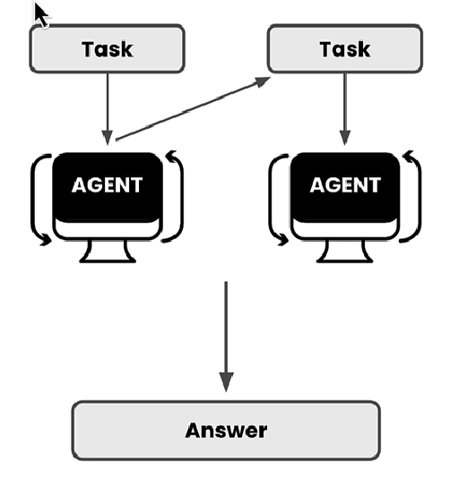

# 🟢 Multi Agent System

* <mark style="color:purple;background-color:purple;">**Grow on top of agent behaviour**</mark>
* <mark style="color:purple;background-color:purple;">**Instead of single agent we can have multiple agents**</mark>
* <mark style="color:purple;background-color:purple;">**So whenever we give tasks, this agents can also give tasks each other**</mark>
* <mark style="color:purple;background-color:purple;">**In the end we get one single answer**</mark>
*

    <figure><figcaption></figcaption></figure>

